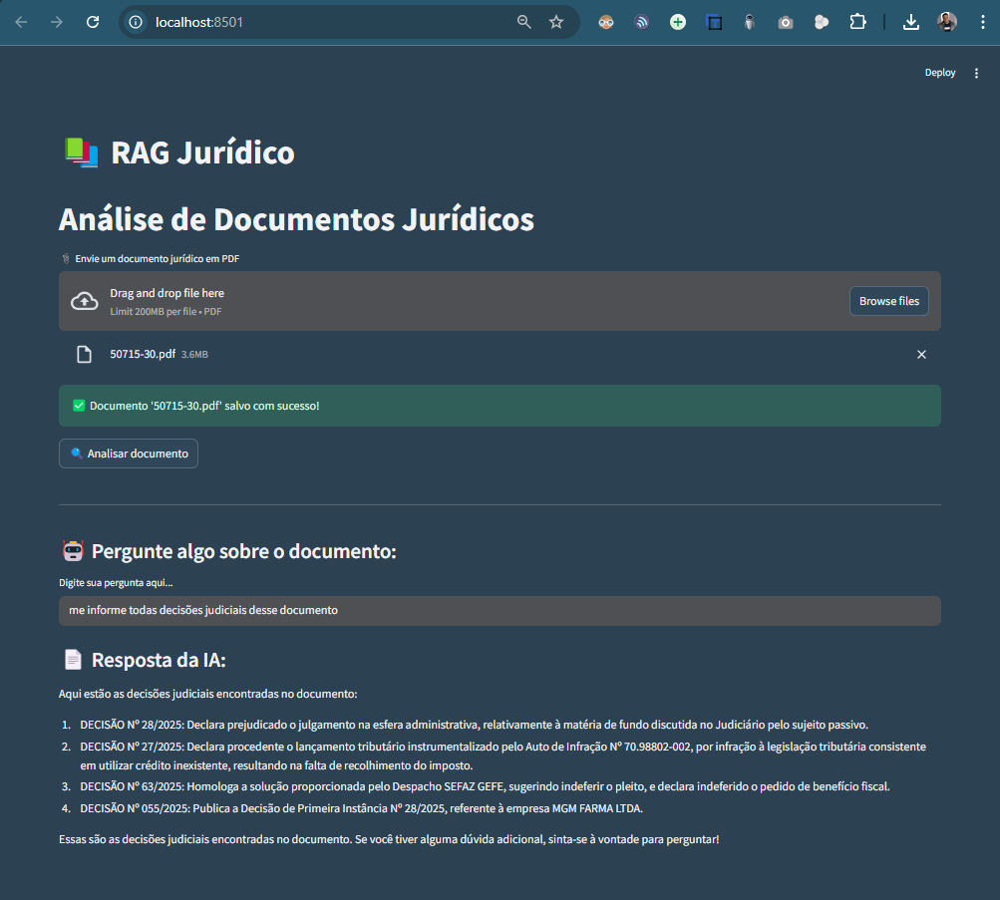

# 🧠 Rag Jurídico

Projeto de RAG (Retrieval-Augmented Generation) voltado para análise de documentos jurídicos com uso de modelos de linguagem (LLMs). Permite carregar arquivos jurídicos (como PDFs) ou coletar dados de APIs públicas, gerar embeddings, indexar os dados com FAISS e realizar perguntas em linguagem natural com respostas baseadas no conteúdo.

---

## 🚀 Objetivo

Demonstrar como a técnica de RAG pode ser aplicada no setor jurídico para facilitar a análise e extração de informações de documentos legais, como contratos, petições, decisões judiciais e pareceres.

---

## Vídeo exibindo o projeto em funcionamento
- https://www.linkedin.com/feed/update/urn:li:activity:7326319147112402945/

---

## 🖼️ Exemplo do Sistema

Veja abaixo uma prévia do layout da aplicação em execução:



---

## 🔧 Tecnologias Utilizadas

- Python 3.10+
- Streamlit
- LangChain
- FAISS
- Sentence-Transformers
- Llama API (via Groq)
- Docling
- Pytest (testes automatizados)

---

## 📁 Estrutura do Projeto

```
rag_juridico/
│
├── app.py                 # Interface com Streamlit
├── rag_pipeline.py        # Pipeline de ingestão, embedding, indexação e resposta
├── utils.py               # Funções auxiliares (carregamento, token count, etc.)
├── requirements.txt       # Bibliotecas necessárias
├── pytest.ini             # Configurações de teste
├── LICENSE                # Licença do projeto
├── README.md              # Este arquivo
│
├── assets/
│   └── layout_sistema.png
│
├── .streamlit/
│   ├── secrets.toml       # Para deploy seguro
│   └── config.toml
│
├── data/
│    ├── documentos/        # PDFs ou documentos de entrada
│    └── indexes/           # FAISS index gerado para os documentos
│
├── tests/
│   ├── test_pipeline.py   # Testes do pipeline principal
│   └── test_utils.py      # Testes das funções auxiliares
```

---

## ▶️ Como Executar

1. Crie e ative um ambiente virtual:
```bash
python -m venv venv
source venv/bin/activate  # ou venv\Scripts\activate no Windows
```

2. Instale as dependências:
```bash
pip install -r requirements.txt
```

3. Execute o app:
```bash
streamlit run app.py
```

---

## 🧪 Testes Automatizados

Este projeto utiliza **pytest** para testes unitários automatizados. Os testes estão localizados na pasta `tests/` e cobrem:

- Funções auxiliares (`utils.py`)
- Pipeline de ingestão e RAG (`rag_pipeline.py`)

### ✔️ Executar os testes

Com o ambiente virtual ativado, execute:

```bash
pytest tests/
```

### 🧹 Limpeza automática

Os testes criam arquivos temporários como índices FAISS. Esses arquivos são **automaticamente removidos** após os testes.

---

## 🛠️ Funcionalidades

- [x] Upload de documentos jurídicos
- [x] Extração e chunking do texto
- [x] Geração de embeddings
- [x] Indexação com FAISS
- [x] Consulta via LLM com base nos documentos
- [x] Testes automatizados com `pytest`
- [ ] Coleta de dados de APIs públicas
- [ ] Histórico de consultas
- [ ] Geração de relatórios automáticos

---

## 📌 Considerações Técnicas

Este projeto implementa um sistema de **RAG tradicional**, com fluxo linear de ingestão, indexação vetorial e recuperação via FAISS, complementado por um LLM (Groq + LLaMA3) para geração de respostas baseadas em documentos jurídicos.

A arquitetura atual é adequada para:
- 🟢 **Ambientes de produção leve**
- 🧪 **Demonstrações institucionais**
- 📄 **Casos de uso com análise direta de documentos em PDF**

### 🧠 Possível Evolução: RAG com LangGraph

Para cenários mais dinâmicos, como:
- Fluxos de análise em múltiplas etapas (ex: sumarização + verificação + resposta)
- Retenção de estado conversacional
- Processamento condicional com agentes LLM

... é recomendada a adoção do **LangGraph**, que permite orquestração avançada, controle de fluxo personalizado e maior escalabilidade em interações complexas.

Essa distinção reforça a **intenção arquitetural do projeto**: começar simples, mas com base sólida para futura evolução.

---

## 👨‍💼 Desenvolvido por

**Mewerton de Melo Silva**  
Ciência de Dados | Inteligência Artificial  
Contato: [LinkedIn](https://www.linkedin.com/in/mewerton/)

---

## 📄 Licença

Este projeto está sob a licença MIT. Veja o arquivo `LICENSE` para mais detalhes.
